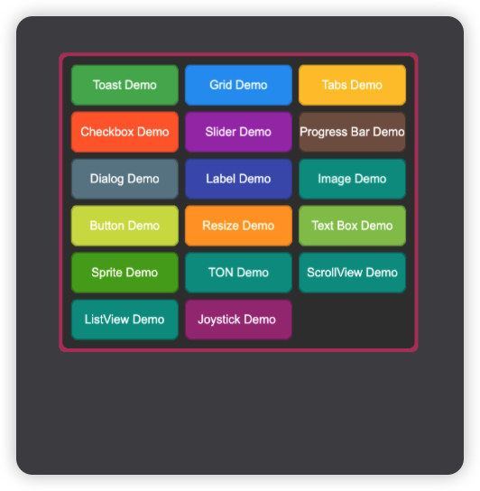
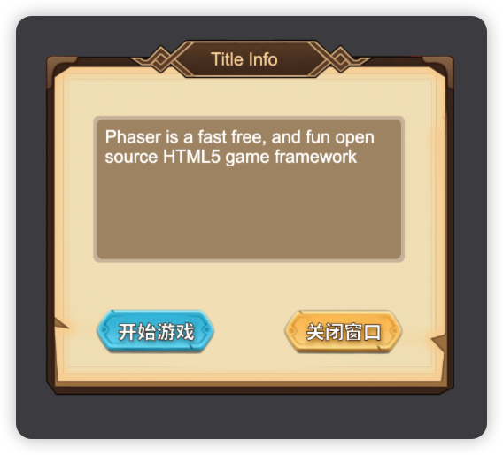
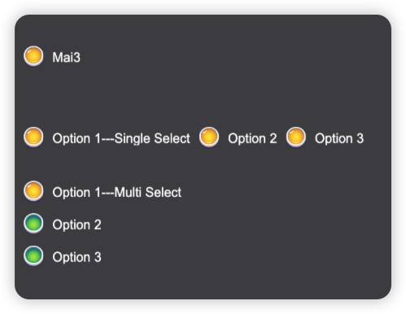
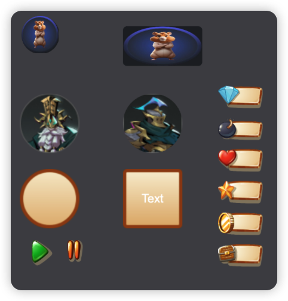

# mai3-phaser-sdk - Phaser 3 UI Components Library

**mai3-phaser-sdk** is a highly customizable and reusable UI component library designed specifically for the **Phaser 3** game engine. With this library, developers can quickly create and integrate essential UI elements like buttons, sliders, dialogs, and more into Phaser-based games, reducing the complexity of UI implementation and allowing more focus on gameplay.

## Key Features

- **Phaser 3 Compatibility**: Fully compatible with Phaser 3.8+.
- **Customizable Components**: Provides out-of-the-box UI components such as buttons, sliders, checkboxes, dialogs, and more.
- **TypeScript Support**: Includes TypeScript types for a better development experience.
- **Flexible Event Handling**: Easy-to-use event handlers for interactions like clicks, hovers, and value changes.
- **Responsive Design**: Adaptable UI elements that work across different screen sizes and game layouts.

## Supported Components

- ✅ Checkbox
- ✅ CheckboxGroup
- ✅ Container
- ✅ Dialog
- ✅ Grid
- ✅ LinearLayout
- ✅ Image
- ✅ ImageButton
- ✅ Label
- ✅ ProgressBar
- ✅ RoundedButton
- ✅ Slider
- ✅ Tabs
- ✅ Text
- ✅ TextBox
- ✅ TextButton
- ✅ Toast
- ✅ VolumeSlider
- ✅ Sprite
- ✅ ScrollView
- ✅ ListView

## Installation

Install **mai3-phaser-sdk** via npm or yarn:

```bash
npm install @mai3/phaser-sdk
# or
yarn add @mai3/phaser-sdk
```

## Configuration
If you're using vite, you'll need to run `npm install @esbuild-plugins/node-globals-polyfill --save-dev` or `yarn add --dev @esbuild-plugins/node-globals-polyfill` and add the following to your vite.config.ts to enable `buffer` support:
```typescript
import { NodeGlobalsPolyfillPlugin } from "@esbuild-plugins/node-globals-polyfill";

[...]
export default defineConfig({
  [...]
    optimizeDeps: {
        esbuildOptions: {
            define: {
                global: "globalThis",
            },
            plugins: [
                NodeGlobalsPolyfillPlugin({
                    buffer: true,
                }),
            ],
        },
    },
  [...]
});
```

## Usage Example

Here’s a quick example of how to create different types of buttons using the **mai3-phaser-sdk** library:

```typescript
import { BaseScene, Mai3Game, Mai3Plugin } from "@mai3/phaser-sdk";

export class ButtonDemo extends BaseScene {

  constructor() {
    super('ButtonDemo');
  }
  
  preload() {
    super.preload();
  }

  create() {
    this.createImageButton();
  }

  private createImageButton() {
    this.mai3.add.imageButton({
      x: 10,
      y: 160,
      width: 160,
      height: 60,
      texture: "StartGameButton",
      borderWidth: 3,
      handleHover: {
        audio: "sfx-hover",
        texture: "StartGameButtonHover",
      },
      handleOut: {
        texture: "StartGameButton",
      },
      handleDown: {
        audio: "sfx-press",
        texture: "StartGameButtonDown",
        handleFn: () => {
          console.log("Button pressed");
        }
      },
      handleUp: {
        texture: "StartGameButton",
        handleFn: () => {
          console.log("Button released");
        }
      },
    });
  }
}

const config = getGameConfig();
const game = Mai3Game.Init(config);
game.scene.add('ButtonDemo', ButtonDemo, true);

//==== config.ts ====
export function getGameConfig() {
  const config: Phaser.Types.Core.GameConfig = {
    type: Phaser.AUTO,
    backgroundColor: '#00746b',
    scale: {
      width: 960,
      height: 1280,
      mode: Phaser.Scale.FIT,
      autoCenter: Phaser.Scale.CENTER_HORIZONTALLY
    },
    dom: {
      createContainer: true
    },
    parent: 'root',
    physics: {
      default: 'arcade',
      arcade: {
        debug: true,
        gravity: { x: 0, y: 0 }
      }
    },
  };

  return config;
}
```

This example demonstrates how to integrate different types of buttons, including text, draggable, rounded, and image buttons, all fully customizable through the **mai3-phaser-sdk** library.

## Live Demos

You can explore various **mai3-phaser-sdk** components by following these steps:

```bash
# Clone the repository
git clone https://github.com/MiracleAI-Labs/mai3-phaser-sdk

cd mai3-phaser-sdk

yarn install

yarn build

# Navigate to the examples directory
cd examples

yarn install


yarn start
```

## Example Screenshots









## Contribution

We welcome contributions! If you’d like to help improve **mai3-phaser-sdk**, feel free to submit issues or pull requests on our [GitHub repository](https://github.com/MiracleAI-Labs/mai3-phaser-sdk).

## License

This project is licensed under the MIT License. For details, check the [LICENSE](https://github.com/MiracleAI-Labs/mai3-phaser-sdk/blob/main/LICENSE) file.